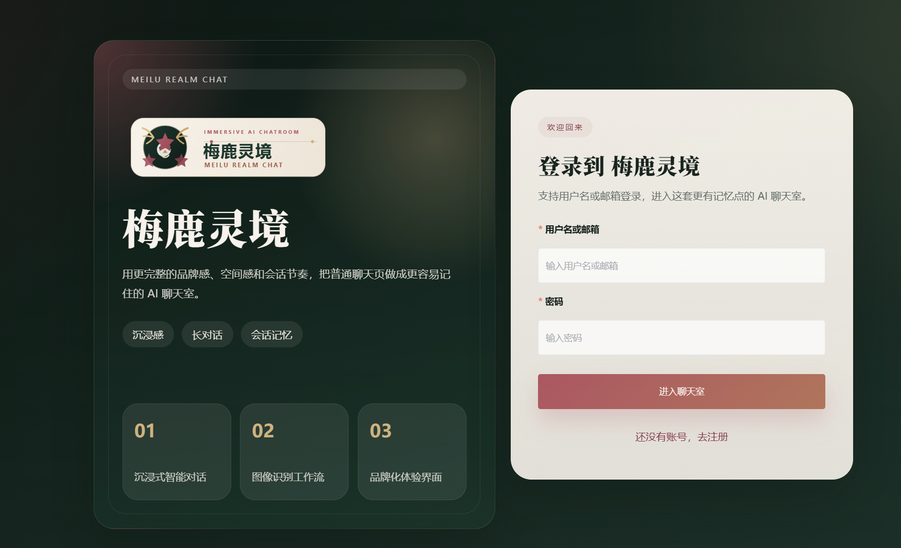
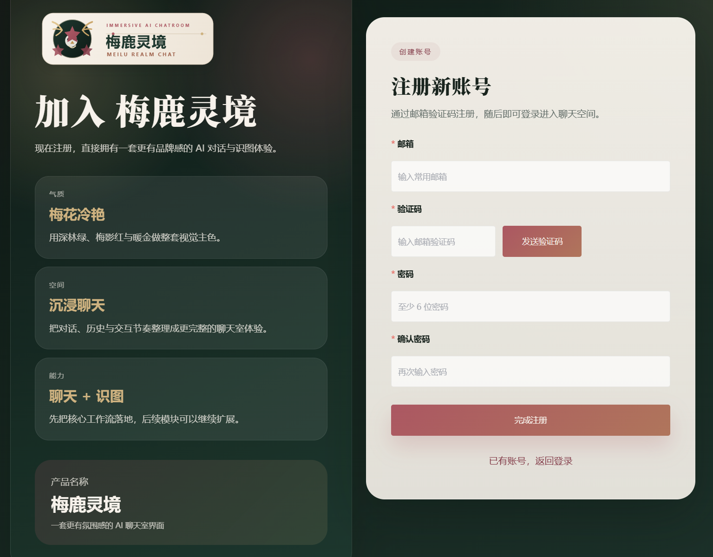
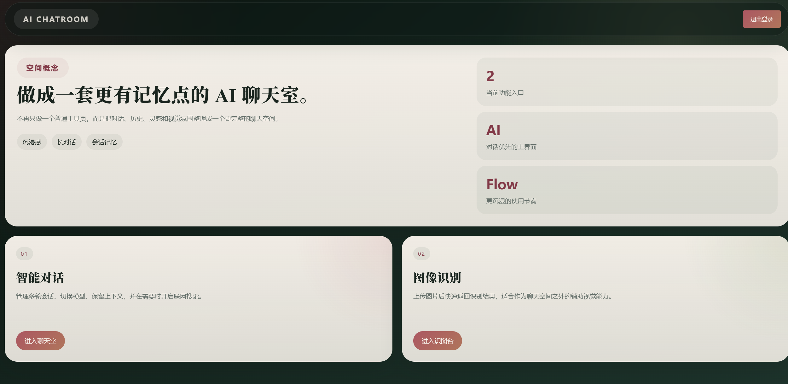
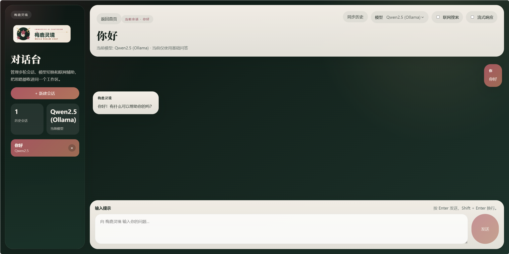

# AI Conversational Application Service Platform

一个基于 Go + Gin + Vue 3 的前后端分离 AI 对话平台。当前版本已经支持邮箱验证码注册、用户名或邮箱登录，以及云端模型和本地 `Ollama` 双模型聊天。

## 功能特性

- 邮箱验证码注册
- 注册成功后自动生成用户名，并通过邮件发送给用户
- 支持 `用户名 / 邮箱 + 密码` 登录
- 支持云端 AI 聊天
- 支持本地 `Ollama` 聊天
- 支持会话创建、历史记录查看、删除会话
- 支持流式响应
- 支持本地模型下的联网搜索开关
- 后端启动时自动迁移用户、会话、消息表

## 技术栈

- 后端: Go 1.24, Gin, GORM, MySQL, Redis, RabbitMQ
- 前端: Vue 3, Vue Router, Element Plus, Axios
- 模型接入: OpenAI 兼容接口云模型, Ollama 本地模型

## 项目结构

```text
.
├─common/            # 基础能力，如 AI、Redis、MySQL、邮件、RabbitMQ
├─config/            # 项目配置
├─controller/        # HTTP 控制层
├─dao/               # 数据访问层
├─middleware/        # 中间件
├─model/             # 数据模型
├─router/            # 路由注册
├─service/           # 业务逻辑
├─utils/             # 工具方法
├─vue-frontend/      # Vue 3 前端
└─main.go            # 后端启动入口
```

## 当前登录与聊天能力

### 注册

- 用户通过邮箱获取验证码
- 调用注册接口完成注册
- 系统自动生成用户名
- 用户名会通过邮件发送给注册邮箱

### 登录

- 登录接口字段为 `account`
- `account` 同时支持输入用户名或邮箱
- 登录成功后返回 JWT

### 聊天

- `modelType = 1` 表示云端模型
- `modelType = 2` 表示本地 `Ollama`
- 支持新建会话、继续会话、历史记录同步、删除会话
- 支持普通响应和 SSE 流式响应

## 快速启动

### 1. 准备依赖

启动前请先准备好以下服务:

- MySQL
- Redis
- RabbitMQ
- Node.js / npm
- Ollama

如果只测试云端模型，可以不启用本地 `Ollama` 聊天；如果只测试本地模型，也可以不填写云端模型配置。

### 2. 配置后端

编辑 `config/config.toml`，填入你自己的本地配置。仓库中的默认配置已经去掉真实敏感信息，可直接作为模板使用。

重点配置项如下:

| 配置段 | 说明 |
| --- | --- |
| `mainConfig` | 后端监听地址和端口 |
| `emailConfig` | 发件邮箱与授权码 |
| `redisConfig` | 验证码缓存配置 |
| `mysqlConfig` | 用户、会话、消息存储数据库配置 |
| `jwtConfig` | JWT 签发配置，`key` 必须替换为你自己的随机密钥 |
| `rabbitmqConfig` | 消息异步持久化队列配置 |
| `aiConfig` | 云端模型配置，使用兼容 OpenAI 接口的服务即可 |
| `ollamaConfig` | 本地 `Ollama` 地址和模型名 |
| `searchConfig` | 本地模型联网搜索开关和检索参数 |

### 3. 启动后端

```bash
go mod tidy
go run main.go
```

默认监听地址:

```text
http://localhost:9091
```

### 4. 启动前端

```bash
cd vue-frontend
npm install
npm run serve
```

默认前端地址:

```text
http://localhost:8081
```

## 主要接口

### 用户模块

- `POST /api/v1/user/captcha` 发送邮箱验证码
- `POST /api/v1/user/register` 邮箱注册
- `POST /api/v1/user/login` 用户名或邮箱登录

### 聊天模块

- `GET /api/v1/AI/chat/sessions` 获取会话列表
- `POST /api/v1/AI/chat/send-new-session` 创建新会话并发送消息
- `POST /api/v1/AI/chat/send` 已有会话继续聊天
- `POST /api/v1/AI/chat/history` 获取会话历史
- `POST /api/v1/AI/chat/delete` 删除会话
- `POST /api/v1/AI/chat/send-stream-new-session` 新会话流式聊天
- `POST /api/v1/AI/chat/send-stream` 已有会话流式聊天

## 安全说明

- 仓库内已移除真实邮箱、邮箱授权码、JWT 密钥、RabbitMQ 密码、云端模型 Key 等敏感信息
- 运行日志中不再打印 JWT Token 和 RabbitMQ 连接串
- 已补充 `.gitignore`，避免日志、构建产物、依赖目录和临时文件进入仓库

## 说明

仓库中还保留了图像识别相关代码入口，但当前 README 重点说明的是注册、登录和 AI 聊天主链路。

## 界面展示

### 登录界面



### 注册界面



### 选择界面



### 聊天界面



## 作者

梅花三鹿
